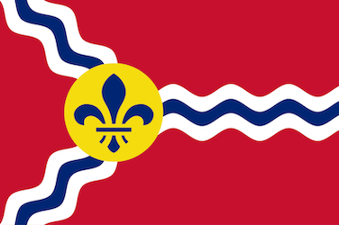

---

layout: col-sidebar
title: OWASP Saint Louis
tags: stl
level: 0
region: North America

---

## Welcome

 

Welcome [Greater St. Louis area](https://en.wikipedia.org/wiki/Greater_St._Louis) and beyond!  We are the the local 
chapter serving Missouri and southern Illinois.  Our mission is to make software security visible, so that individuals 
and organizations worldwide can make informed decisions about software security risks.  

## Meetups

We try to meet 6 times per year with a mix of presentations, demonstrations, and hackathons (CTFs).

Meeting locations vary but we often meet in downtown St. Louis.  When meeting in person, food and drinks are provided 
by our generous sponsors.

View the latest meetup events and RSVP [here](https://www.meetup.com/OWASP-STL/events/).

_**Everyone is welcome to join us at our chapter meetings.**_

## Safety Tips & Guides

**Ransomware Cheatsheet** - <http://owasp-stl.org/guides/owasp_ransomware.pdf>

**Online Shopping Tips** - <http://owasp-stl.org/guides/owasp_onlineshippingtips.pdf>

**Internet of Things Tips** - <http://owasp-stl.org/guides/owasp_internetofthings.pdf>

## Participation

The Open Web Application Security Project (OWASP) is a nonprofit foundation that works to improve the security of 
software. All of our projects, tools, documents, forums, and chapters are free and open to anyone interested in 
improving application security. 

Chapters are led by local leaders in accordance with the 
[Chapter Leader Handbook](/www-policy/rules-of-procedure/chapter-handbook). Financial contributions should only be 
made online using the authorized online donation button. To be a speaker at any OWASP Chapter in the world simply,
review the [speaker agreement](/www-policy/speaker-agreement) and then contact the local chapter leaders with details 
of what OWASP Project, independent research, or related software security topic you would like to present.

Everyone is welcome and encouraged to participate in our [Projects](/projects), [Local Chapters](/chapters), 
[Events](/events), [Online Groups](https://groups.google.com/a/owasp.com/) 
[Community Slack Channel](https://owasp.slack.com/). We especially encourage diversity in all our initiatives. OWASP is 
a fantastic place to learn about application security, to network, and even to build your reputation as an expert. We 
also encourage you to be [become a member](/membership) or consider a [donation](/donate) to support our ongoing work.

## Membership

[Membership](/membership) supports the local chapter in addition to the OWASP Foundation.  Annual memberships are $50 
or $20 for students.